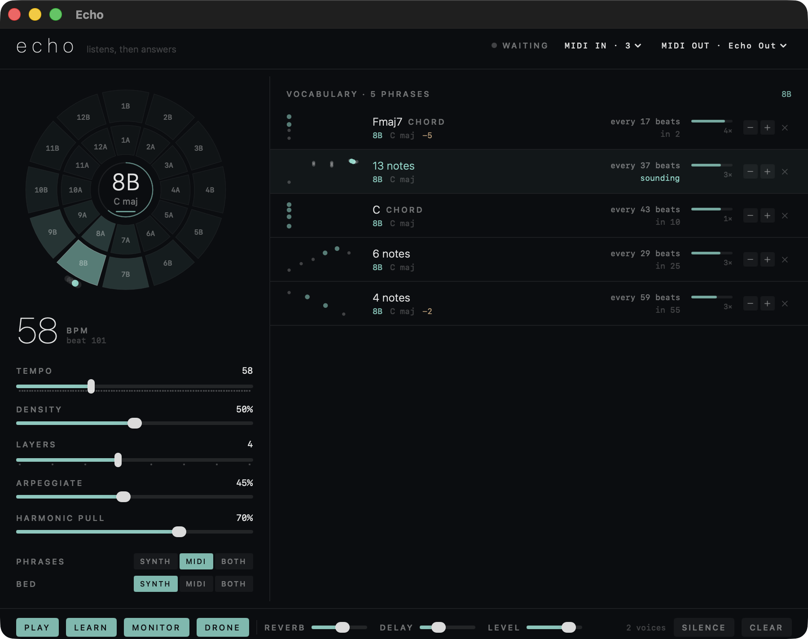

# Echo

A minimal ambient music app for macOS. Echo listens to what you play over MIDI,
builds a vocabulary of phrases from it, and then spends the rest of the session
fragmenting and re-voicing that material — spaced out on prime-numbered periods
so the texture never repeats, and stacked according to the Camelot wheel so the
layers stay harmonically agreeable.

You play for a minute. Echo plays for an hour.



## Running it

```
./build.sh          # build (Debug)
./build.sh run      # build and launch
./build.sh release  # Release, signed with a Developer ID
./build.sh notarize # release, notarized and stapled, into dist/
```

Requires Xcode and `xcodegen` (`brew install xcodegen`). The app is a single
window; there is nothing to configure to get sound.

Releases are **universal** — Apple Silicon and Intel — and need macOS 14 or
later. The signed, notarized build is on the
[releases page](https://github.com/jeffehobbs/echo/releases); unzip it, drag
Echo.app to Applications, and play something.

Two things about building for both architectures, since neither is obvious:
`xcodebuild` resolves "My Mac" to the first of several matching destinations,
which pins `arch=arm64` and quietly overrides `ARCHS` — so `ONLY_ACTIVE_ARCH=NO`
is not enough on its own and the release build passes an explicit
`-destination 'generic/platform=macOS'`. And XcodeGen *generates*
`App/Info.plist` from `project.yml`, so the version lives there; editing the
plist by hand does nothing but get overwritten.

## Getting MIDI into it

Echo connects to **every** CoreMIDI source it can see, and re-scans whenever the
MIDI setup changes — so a controller or an app that appears later is picked up
without a restart. It also publishes its own virtual destination named **Echo**,
so any app that can pick an output can send straight to it.

With Novation Play, either route works: if it exposes an output port, Echo is
already listening to it; otherwise select **Echo** as Play's MIDI destination.
The same is true of any other MIDI app or hardware — nothing in Echo is specific
to one controller. `MIDI IN · n` in the header counts what it is listening to,
and the menu there lets you mute individual sources.

Echo does not sound what you play. Your controller (or the app driving it) is
already making that sound, so doubling it would only thicken the attack — Echo
listens, and answers a while later. If you are playing a controller with no voice
of its own and want to hear yourself, switch **monitor** on.

Control-surface ports are **not** connected automatically — anything whose name
contains "DAW" (Novation's DAW Out, and the equivalent on most grid
controllers) carries pad presses, knob moves and mode changes rather than
performance, and learning those as phrases is never what you want. They still
appear in the menu if you do want them.

Sustain (CC 64) is honored while capturing, so pedaled chords are heard as one
phrase — but resting still ends a phrase whether or not the pedal is down, so a
controller that latches CC 64 cannot wedge capture. CC 121 and CC 123 clear it.

## Sending it back out

Echo's two streams are routed independently:

- **phrases** — the chords and melodies
- **bed** — the low drone

Each can go to the internal **synth**, out over **MIDI**, or **both**. The
combination worth knowing about: phrases to MIDI, bed to synth. Echo keeps the
ambient bed and your external instrument plays the material — Echo becomes the
composer and something else becomes the voice.

Phrases go out on **channel 1**, the bed on **channel 2**. Echo always publishes
a virtual source named **Echo Out** that any app can subscribe to, and the
`MIDI OUT` menu can additionally point it at one destination directly. Choosing
a destination routes the phrases to it automatically.

Pan, timbre and the envelopes only mean anything to the internal synth; over
MIDI, pitch, velocity and note length are all that survive. Note-offs are
queued the moment a note starts, so they fire even if you change the routing
mid-note, and Echo sends all-notes-off when it quits — nothing is left hanging
on an external instrument.

Echo never listens to its own output: its endpoints are excluded from its own
input, and any note it just sent is ignored for a moment afterward in case you
have wired a loopback (an IAC bus pointed both ways).

Settings — tempo, density, routing, the chosen destination, mixer — are
remembered between launches. The vocabulary is not; each session starts by
listening.

## How it listens

A phrase is committed when you rest: any notes played, then about 1.4 seconds of
silence. Notes played within ~110 ms of each other are recorded as a chord,
anything more spread out as a line. Timing is stored **in beats**, not seconds,
so moving the tempo re-times the whole vocabulary rather than stretching it.

Each phrase is analyzed on the way in:

- **Key.** Krumhansl-Kessler profile matching over a duration-weighted
  pitch-class histogram. For chords the named root wins instead — an A-C-E-G
  voicing is Am7 in A minor, not C6 in C major, and that difference decides
  which slot of the wheel it lands on.
- **Position on the Camelot wheel.** C major is 8B, A minor is 8A, and +1 around
  the ring is a fifth up, the usual harmonic-mixing layout.
- **Weight.** How loud, how long and how many notes, plus how confident the key
  read was. Weight is what decides how present a phrase is.

Playing the same phrase again **reinforces** it rather than adding a copy.
Matching is on interval shape and rhythm, so the same figure in another register
counts as the same word.

## How it plays

Every phrase is broken into fragments — contiguous motifs of every useful
length, thinned readings that take every second or third note, chord shells,
single accented notes. A fragment is chosen by stepping through that list by a
prime, so the order of fragments never falls into step with anything else.

**Primes are the whole clock.** Each phrase recurs on a prime number of beats
(5, 7, 11 … 101), and no two phrases share one. Because the periods are coprime,
the *combination* of phrases sounding together only repeats after their product
of beats — which is to say, never. Fragment choice, time-stretching, octave
displacement, reversal and the arpeggio gate all step on their own primes too.

Which prime a phrase gets is set by its weight, judged **relative** to the rest
of the vocabulary: the most present phrase gets the shortest period, the
faintest the longest. Every airing costs a phrase a little weight, so material
recedes as it is used and newly played phrases come forward — but because the
allocation is relative, a long session never drifts into everything-is-quiet.

**Register.** A fragment is displaced by an octave now and then — half the
airings sit where they were played, a third drop an octave, a sixth rise one —
but never further down than that, nothing sounds below C2, and a note in the
bass is held for at most three seconds. Down there a held fragment stops reading
as a phrase and starts reading as a drone, which is not the same thing and gets
in the way of the music above it.

**Camelot placement.** Before a phrase enters, Echo looks at what is already
ringing — the session key plus every sounding layer, weighted — and picks a
transposition that sits well on top of it: leave it where it was played, move it
into the session key, or move it to a neighbor on the wheel. `harmonic pull`
decides how strongly it prefers the key over the phrase's own colour. Measured
over an hour of generated output, near-simultaneous entrances average 0.84
compatibility with 1% clashes.

**Manipulations.** Four ways a phrase can be turned over on its way out, each
with its own amount:

- **arp** — a chord breaks out instead of sounding as a block. Up, down,
  up-and-back, or a figure that keeps returning to the root; one to three
  passes, sometimes climbing an octave; step sizes of a half, third, quarter or
  sixth of a beat.
- **tape** — the phrase plays at another speed with pitch and time locked, the
  way a tape machine couples them: down an octave at half speed, or up an octave
  at double. Because they move together it still reads as the same gesture,
  which an uncoupled stretch does not.
- **rev** — the phrase plays backwards.
- **shuffle** — the notes are dealt into different slots of the same rhythm.
  Velocity and duration stay with the slot, so the groove and its accents
  survive and only the tune changes.

Each is gated by one of four primes dealt to that phrase without replacement, so
a given phrase arpeggiates every 2nd airing, tapes every 5th, reverses every
7th — some order of 2, 3, 5 and 7 — and the four never coincide on a schedule.
Per phrase that means rates of 50%, 33%, 20% and 14% of the slider; across a
vocabulary they even out. Arpeggio and shuffle both rebuild the order, so
reverse yields to either, and the two never combine with each other.

A low drone on the session key comes in every 23 beats — another prime, so the
bed never lines up with what is above it. It stays silent until Echo has heard
something; the app answers, it doesn't start on its own. The bed can use any of
the four voices, and switching restarts it on the spot: a bed note lasts most of
those 23 beats, and waiting half a minute to hear the tone you just picked is no
way to choose one. Measured, the four differ from 186 Hz to 320 Hz of spectral
brightness — deep is the darkest, bell the brightest.

## The synth

Four preallocated timbres (glass, wood, deep, bell) built from detuned partial
stacks, each voice with its own slow tremolo, a velocity-tracking lowpass, long
attacks and multi-second releases, spread across the stereo field. Forty voices
into a tempo-synced delay, a large hall reverb, and a peak limiter. Nothing
allocates on the render thread; note commands cross over through a try-lock
queue.

Levels are measured, not guessed: `AudioOutput(offline:)` renders the whole
chain without a sound card, so a long session can be checked in seconds. Thirty
simulated minutes of eight phrases over the drone sits around −19 dBFS RMS with
peaks near −2 dB, drifts under a decibel, and never reaches full scale — the
limiter is a safety net rather than a gain stage.

## Controls

| | |
|---|---|
| **tempo** | Beats per minute. Maps the cadence of everything — phrases are stored in beats. |
| **density** | Compresses or stretches every recurrence period at once. |
| **layers** | How many phrases may sound at the same time. |
| **arp / tape / rev / shuffle** | How often each manipulation fires. Tape moves pitch and speed together (an octave down at half speed, or up at double); shuffle re-orders the notes inside the same rhythm. |
| **harmonic pull** | 0 stacks phrases in the keys they were played in; 1 pulls everything into the session key. |
| **play / learn** | Stop answering / stop listening. Independent. |
| **monitor** | Whether Echo also sounds what you play. **Off by default** — anything that can send MIDI usually has its own voice, and doubling it is never what you want. Turn it on for a controller with no sound of its own. |
| **drone** | The low bed. |
| **phrases / bed** | Where each stream goes: internal synth, MIDI out, or both. |
| **tone** | Which of the four voices the bed uses — glass, wood, deep, bell. Changing it restarts the bed immediately rather than waiting out its current note. |

The wheel shows the detected session key, how compatible every other slot is
with it, and a dot per phrase on the slot it currently occupies. In the
vocabulary list, tap a row to hear it now, `+`/`−` to make a phrase more or less
present, `×` to forget it. The thumbnail lights up the notes of the fragment
that played last.

**The last thing Echo learned** sits in a banner above the list, with its shape,
its slot on the wheel, how often it will recur, and a discard button — because
the list is sorted by weight, so the newest phrase is not reliably at the top,
and a phrase you did not mean to play wants throwing away immediately.
`⌘⌫` discards it without reaching for the mouse; the row it refers to is marked
with a hairline in the list. A phrase played again is shown as *heard again*
rather than learned, since Echo reinforces repeats instead of storing duplicates.

## Layout

```
App/            Info.plist, AppIcon.icns
Sources/
  MusicTheory   keys, the Camelot wheel, key finding, chord naming
  Phrase        phrase capture from live MIDI, fragmentation
  Weaver        the composer: vocabulary, beat clock, prime scheduling, placement
  SynthEngine   voice bank and the AVAudioEngine chain
  MIDIInput     CoreMIDI sources, the virtual destination, loopback guard
  MIDIOutput    the virtual "Echo Out" source and the chosen destination
  Support       clock, primes, deterministic RNG, render-thread queue
  ContentView   the interface
Tools/
  midifeed      sends a short improvisation to Echo, for testing without a controller
  icon/         regenerates AppIcon.icns
```

`Weaver.debugRun(beats:)` and `Weaver.debugLogging` run the beat logic on a
synthetic clock, which is how the numbers quoted above were measured — useful
for checking a change to the scheduling without listening to an hour of it.

Set `ECHO_MIDI_LOG=1` to log every MIDI message Echo accepts, which is the
fastest way to tell a routing problem from a capture problem:

```
ECHO_MIDI_LOG=1 ./build/Build/Products/Debug/Echo.app/Contents/MacOS/Echo
```

### Testing without a controller

```
cd Tools
swiftc -O -o midifeed midifeed.swift
./midifeed            # plays chords and lines into the "Echo" destination

swiftc -O -o midimonitor midimonitor.swift
./midimonitor "Echo Out" 30    # prints what Echo sends, and flags stuck notes
```
